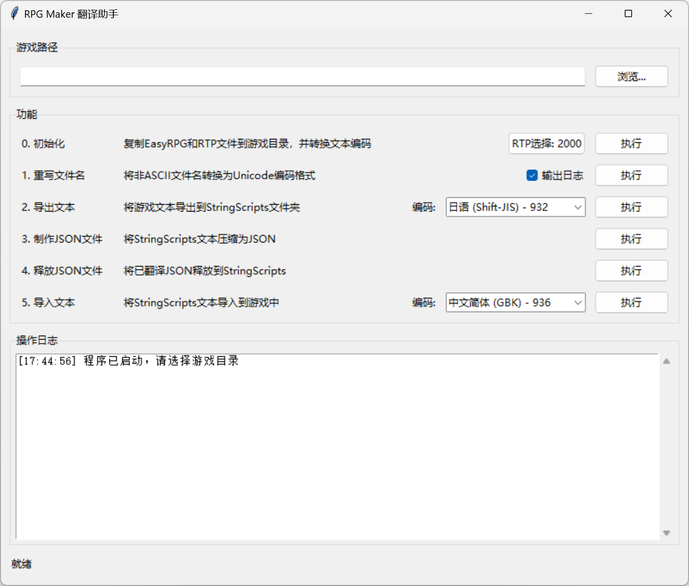

# RPG Maker 翻译助手


这是一个用于RPG Maker 2000/2003游戏翻译的辅助工具，它提供了一个友好的图形界面，简化了RPGRewriter的复杂功能，使翻译工作更加高效。

<p align="center">
  
</p>

## 功能特点

1. **一键初始化**：
   - 自动复制EasyRPG播放器到游戏目录
   - 根据选择解压RPG Maker RTP资源包
   - 自动转换文本文件编码

2. **智能文件名重写**：
   - 自动将非ASCII文件名转换为Unicode编码格式
   - 确保游戏在所有语言环境下正常运行

3. **文本导出与导入**：
   - 将游戏文本导出到可编辑的StringScripts文件夹
   - 支持多种编码格式的导入导出

4. **JSON文件处理**：
   - 生成压缩的JSON格式翻译文件
   - 支持将翻译后的文本应用回游戏

5. **全中文界面**：
   - 简洁直观的用户界面
   - 详细的操作日志和状态提示

## 下载与安装

### 预编译版本

1. 从[Releases页面](https://github.com/SomiaWhiteRing/RPGTranslationAssistant/releases)下载最新版本
2. 解压缩下载的zip文件到任意位置
3. 运行`RPGTranslationAssistant.exe`

### 从源码安装

1. 克隆此仓库：
   ```
   git clone https://github.com/SomiaWhiteRing/RPGTranslationAssistant.git
   cd RPGTranslationAssistant
   ```

2. 确保已安装Python 3.7或更高版本

3. （可选）创建并激活虚拟环境：
   ```
   python -m venv venv
   venv\Scripts\activate  # Windows
   source venv/bin/activate  # Linux/Mac
   ```

4. 直接运行程序：
   ```
   python RPGTranslationAssistant.py
   ```

### 构建为可执行文件

1. 按照"从源码安装"的步骤1-3进行操作
2. 双击运行`build.bat`或执行：
   ```
   python build_exe.py
   ```
3. 按照提示选择构建模式
4. 构建完成后，可执行文件将位于`dist`目录中

## 目录结构

- `RPGTranslationAssistant.py` - 主程序文件
- `build_exe.py` - 打包脚本
- `build.bat` - Windows批处理打包脚本
- `RPGRewriter/` - RPGRewriter程序文件
- `EasyRPG/` - EasyRPG播放器文件
- `RTPCollection/` - RPG Maker RTP资源包（zip格式）
- `Works/` - 翻译工作文件
  - `{游戏名}/untranslated/` - 原始文本JSON
  - `{游戏名}/translated/` - 翻译后的JSON

## 工作流程

1. **初始化**：选择游戏目录并执行初始化，配置RTP资源包
2. **重写文件名**：使非ASCII文件名符合所有语言环境
3. **导出文本**：将游戏文本导出到StringScripts文件夹
4. **制作JSON文件**：生成用于翻译的JSON文件
5. **翻译**：使用任何编辑器翻译JSON文件，将结果放入Works/{游戏名}/translated目录
6. **释放JSON文件**：将翻译应用到StringScripts文件夹
7. **导入文本**：将翻译后的文本导入回游戏

## 注意事项

- 在翻译前请备份您的游戏文件
- 如果游戏使用了非标准RTP，可能需要额外的处理
- 某些游戏可能使用了特殊的脚本或加密，可能需要先解密
- 本工具需要启用JavaScript的权限才能正常工作

## 常见问题

**Q: 为什么我应该使用多文件模式而不是单文件模式？**  
A: 多文件模式启动更快，而且包含了所有必要的资源文件。单文件模式虽然便于分发，但启动缓慢且可能无法正确访问资源文件。

**Q: 编码转换时显示错误怎么办？**  
A: 程序会尝试多种编码（Shift-JIS、GBK、CP932、Latin1）。如果都失败，表明文件可能使用了特殊编码或已损坏。

**Q: 可以翻译加密的RPG Maker游戏吗？**  
A: 一般情况下不能。您需要先使用专门的解密工具解密游戏，然后再使用本工具翻译。

## 贡献指南

我们欢迎各种形式的贡献！

1. Fork本仓库
2. 创建您的特性分支: `git checkout -b my-new-feature`
3. 提交您的更改: `git commit -am 'Add some feature'`
4. 推送到分支: `git push origin my-new-feature`
5. 提交Pull Request

## 致谢

本工具基于以下项目构建：

- [RPGRewriter](https://www.vgperson.com/) by vgperson
- [EasyRPG](https://easyrpg.org/) 项目
- [Python](https://www.python.org/) 及其优秀的社区

## 许可证

本项目自身代码采用MIT许可证 - 详见 [LICENSE](LICENSE) 文件

### 第三方组件许可证

本项目包含以下第三方组件，它们有自己的许可证条款：

- **EasyRPG Player**：GPL-3.0许可证 - [https://easyrpg.org/](https://easyrpg.org/)
- **RPGRewriter**：由vgperson创建，保留所有权利

使用本软件意味着您同意各组件的相应许可证条款。详细的第三方许可证信息请参阅 [THIRD_PARTY_LICENSES.md](THIRD_PARTY_LICENSES.md)。 